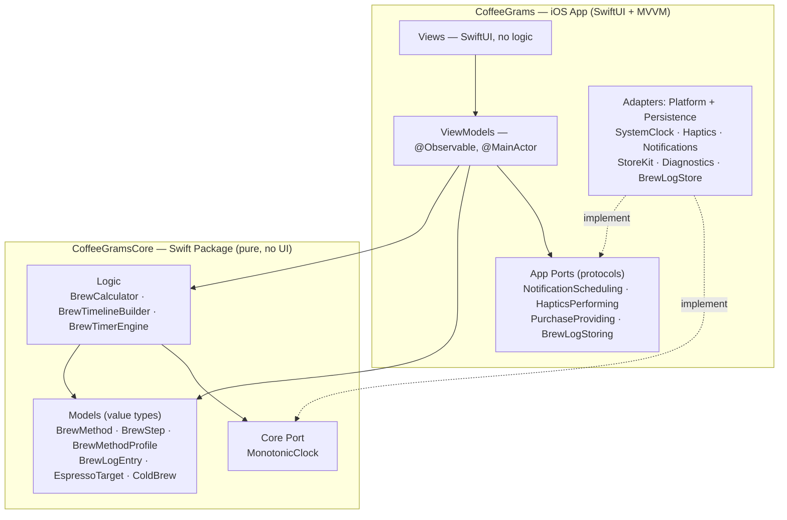
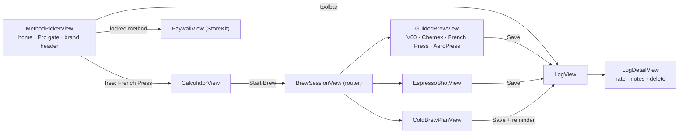
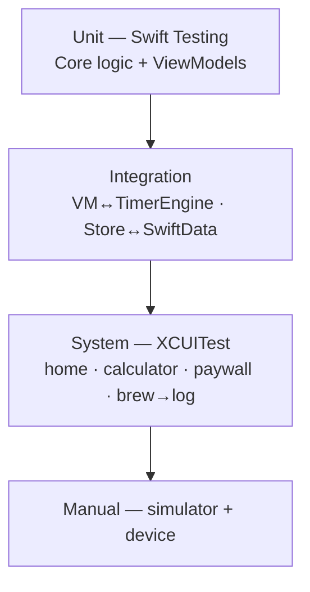

# CoffeeGrams — Architecture

A map of the whole codebase: the layers, what kind of code lives where, how the
pieces depend on each other, and the tech stack. (GitHub renders the Mermaid
diagrams below.)

## Tech stack

| Concern | Choice |
|---|---|
| Language | **Swift 6** (strict concurrency; main-actor default isolation) |
| UI | **SwiftUI** (declarative, no Storyboards), **iOS 17+** |
| Architecture | **MVVM** app layer over a **pure domain package** (Ports & Adapters) |
| State/observation | **Observation** (`@Observable`) |
| Persistence | **SwiftData** (on-device); CloudKit-ready seam |
| In-app purchase | **StoreKit 2** |
| Notifications | **UserNotifications** (local only) |
| Diagnostics | **MetricKit** (on-device, nothing transmitted) |
| Tests | **Swift Testing** (unit/integration) + **XCTest/XCUITest** (UI) |
| Dependencies | **None** (no third-party SDKs) |

## Two layers

The codebase is split so that **all testable logic is UI-free**:

- **`CoffeeGramsCore`** — a Swift package with **no SwiftUI/UIKit imports**. Pure
  domain models + brewing logic + the timer state machine. Runs and is tested
  from the command line (`swift test`).
- **`CoffeeGrams`** — the iOS app (SwiftUI, MVVM). It depends on Core and
  provides the "live" implementations of the side-effect protocols (the clock,
  notifications, haptics, purchases, storage).



**Dependency rule:** arrows point *inward*. Views know ViewModels; ViewModels
know Core + the port protocols; only the concrete Adapters know StoreKit /
SwiftData / UserNotifications. Core knows nothing about the app.

## Directory map

```
Apps/CoffeeGrams/                     ← git repo root
├─ CoffeeGramsCore/                   ← PURE SWIFT PACKAGE (no UI)
│  └─ Sources/CoffeeGramsCore/
│     ├─ Models/      BrewMethod, BrewType, BrewMethodProfile, BrewStep,
│     │               BrewLogEntry, EspressoTarget, ColdBrew   (value types)
│     ├─ Calculator/  BrewCalculator                            (pure math)
│     ├─ Timeline/    BrewTimeline, BrewTimelineBuilder         (recipe → steps)
│     ├─ Timer/       BrewTimerEngine                           (state machine)
│     └─ Ports/       Clock (MonotonicClock protocol)
│
├─ CoffeeGrams/CoffeeGrams/           ← iOS APP
│  ├─ CoffeeGramsApp.swift            App entry; DI (container + PurchaseController)
│  ├─ Features/                       MVVM, one folder per feature
│  │  ├─ MethodPicker/  MethodPickerView                (home + gate + brand header)
│  │  ├─ Calculator/    CalculatorView · CalculatorViewModel · BrewPreset
│  │  ├─ GuidedBrew/    BrewSessionView (router) · GuidedBrew* · EspressoShot* · ColdBrew*
│  │  ├─ Log/           LogView · LogDetailView · StarRating
│  │  └─ Paywall/       PaywallView · PurchaseController
│  ├─ Platform/                       Adapters (side effects)
│  │  ├─ SystemClock          → implements Core's MonotonicClock
│  │  ├─ Haptics              → HapticsPerforming (Live / No)
│  │  ├─ NotificationService  → NotificationScheduling + BrewReminder
│  │  ├─ PurchaseProvider     → PurchaseProviding (StoreKit 2)
│  │  └─ DiagnosticsService   → MetricKit subscriber
│  ├─ Persistence/                    SwiftData
│  │  ├─ BrewLogRecord        @Model  (maps to/from BrewLogEntry)
│  │  └─ BrewLogStore         BrewLogStoring service
│  ├─ Design/                         Theme, presentation extensions, formatting
│  └─ Resources                       Assets.xcassets (colors, AppIcon, Logo),
│                                     PrivacyInfo.xcprivacy, Localizable.xcstrings
│
├─ CoffeeGrams/CoffeeGramsTests/      Swift Testing (unit + integration)
├─ CoffeeGrams/CoffeeGramsUITests/    XCUITest (system / UI regression)
├─ coffeegrams_logo/                  Logo render source (CoreGraphics)
├─ docs/                              Privacy Policy + Support pages
├─ Releases/release_1.1.md            Next-release roadmap
├─ testing.md · DESIGN.md · CLAUDE.md
```

## What kind of code is where

| Type of code | Examples | Traits |
|---|---|---|
| **Domain models** | `BrewMethod`, `BrewStep`, `BrewLogEntry` | value types, `Sendable`, `Codable` |
| **Pure logic** | `BrewCalculator`, `BrewTimelineBuilder`, `BrewTimerEngine` | deterministic, no side effects, unit-tested |
| **Ports** (protocols) | `MonotonicClock`, `NotificationScheduling`, `PurchaseProviding`, `BrewLogStoring`, `HapticsPerforming` | abstractions the app implements |
| **Adapters** | `SystemClock`, `LiveNotificationService`, `StoreKitPurchaseProvider`, `BrewLogStore`, `DiagnosticsService` | the only code that touches OS frameworks |
| **ViewModels** | `CalculatorViewModel`, `GuidedBrewViewModel`, `PurchaseController` | `@Observable @MainActor`; hold state, call logic + ports |
| **Views** | `MethodPickerView`, `CalculatorView`, `PaywallView` | SwiftUI; render state, forward taps, no logic |
| **Persistence model** | `BrewLogRecord` | SwiftData `@Model`; app-only, mapped from the value type |
| **Presentation helpers** | `Theme`, `TimeFormatting`, `*+Presentation` | pure/UI-adjacent extensions |

## The user flow (feature map)



## Side effects: Ports & Adapters

Every side effect is a protocol (port) with a live adapter and a test double, so
the ViewModels stay pure and testable:

| Port (protocol) | Live adapter | Test double | Used for |
|---|---|---|---|
| `MonotonicClock` (Core) | `SystemClock` | `FakeClock` | driving the timers deterministically |
| `HapticsPerforming` | `LiveHaptics` | `NoHaptics` | step-transition feedback |
| `NotificationScheduling` | `LiveNotificationService` | `SpyNotificationService` | cold-brew / French-press reminders |
| `PurchaseProviding` | `StoreKitPurchaseProvider` | `FakePurchaseProvider` | the one-time Pro unlock |
| `BrewLogStoring` | `BrewLogStore` (SwiftData) | in-memory `ModelContainer` | the brew log |

## Data & persistence

- The brew log is stored on-device via **SwiftData** (`BrewLogRecord`), mapped
  to/from the pure `BrewLogEntry` value type so Core stays framework-free.
- **CloudKit seam:** `CoffeeGramsApp` builds the `ModelContainer`; enabling
  iCloud sync later is a localized change (see `release_1.1.md`).
- **Privacy:** no accounts, no analytics, no network calls, no third-party SDKs —
  "Data Not Collected" (`PrivacyInfo.xcprivacy`).

## Testing architecture

Unit + integration in **Swift Testing** (Core package + app), system/UI-regression
in **XCUITest**, continuous regression by re-running the suite. Full details and
run commands in [`testing.md`](./testing.md).

