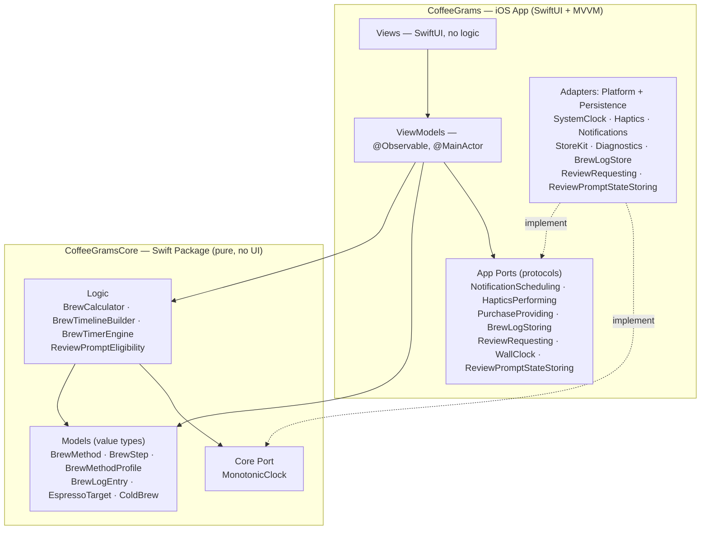
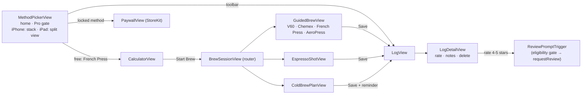
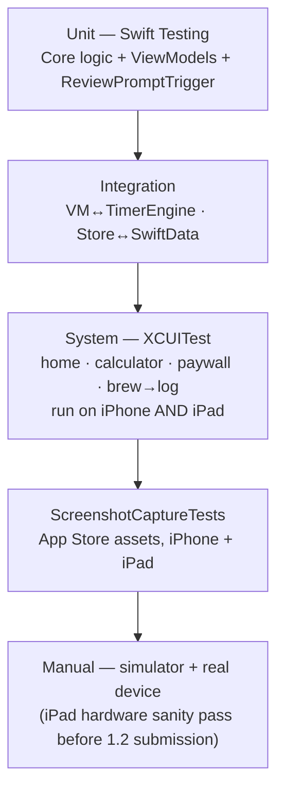

# CoffeeGrams — Architecture

A map of the whole codebase: the layers, what kind of code lives where, how the
pieces depend on each other, and the tech stack. (GitHub renders the Mermaid
diagrams below.)

**Current as of 1.2** (live 2026-09-24) — universal app, iPhone + iPad.

## Tech stack

| Concern | Choice |
|---|---|
| Language | **Swift 6** (strict concurrency; main-actor default isolation) |
| UI | **SwiftUI** (declarative, no Storyboards), **iOS 17+**, universal (iPhone + iPad) |
| Architecture | **MVVM** app layer over a **pure domain package** (Ports & Adapters) |
| State/observation | **Observation** (`@Observable`) |
| Persistence | **SwiftData** (on-device); CloudKit-ready seam |
| In-app purchase | **StoreKit 2** |
| Notifications | **UserNotifications** (local only) |
| Ratings | **StoreKit** `requestReview` (system rating prompt) |
| Diagnostics | **MetricKit** (on-device, nothing transmitted) |
| Tests | **Swift Testing** (unit/integration) + **XCTest/XCUITest** (UI) |
| Dependencies | **None** (no third-party SDKs) |

## Two layers

The codebase is split so that **all testable logic is UI-free**:

- **`CoffeeGramsCore`** — a Swift package with **no SwiftUI/UIKit imports**. Pure
  domain models + brewing logic + the timer state machine + the review-prompt
  eligibility rule. Runs and is tested from the command line (`swift test`).
- **`CoffeeGrams`** — the iOS app (SwiftUI, MVVM). It depends on Core and
  provides the "live" implementations of the side-effect protocols (the clock,
  notifications, haptics, purchases, storage, review requests).


```mermaid
graph TD
    subgraph AppLayer["CoffeeGrams — iOS App (SwiftUI + MVVM)"]
        Views["Views — SwiftUI, no logic"]
        VMs["ViewModels — @Observable, @MainActor"]
        Adapters["Adapters: Platform + Persistence<br/>SystemClock · Haptics · Notifications<br/>StoreKit · Diagnostics · BrewLogStore<br/>ReviewRequesting · ReviewPromptStateStoring"]
        AppPorts["App Ports (protocols)<br/>NotificationScheduling · HapticsPerforming<br/>PurchaseProviding · BrewLogStoring<br/>ReviewRequesting · WallClock · ReviewPromptStateStoring"]
    end

    subgraph CoreLayer["CoffeeGramsCore — Swift Package (pure, no UI)"]
        Models["Models (value types)<br/>BrewMethod · BrewStep · BrewMethodProfile<br/>BrewLogEntry · EspressoTarget · ColdBrew"]
        Logic["Logic<br/>BrewCalculator · BrewTimelineBuilder · BrewTimerEngine<br/>ReviewPromptEligibility"]
        CorePort["Core Port<br/>MonotonicClock"]
    end

    Views --> VMs
    VMs --> Logic
    VMs --> Models
    VMs --> AppPorts
    Adapters -. implement .-> AppPorts
    Adapters -. implement .-> CorePort
    Logic --> Models
    Logic --> CorePort
```

**Dependency rule:** arrows point *inward*. Views know ViewModels; ViewModels
know Core + the port protocols; only the concrete Adapters know StoreKit /
SwiftData / UserNotifications. Core knows nothing about the app.

## Directory map

```
Apps/CoffeeGrams/                     ← git repo root
├─ CoffeeGramsCore/                   ← PURE SWIFT PACKAGE (no UI)
│  └─ Sources/CoffeeGramsCore/
│     ├─ Models/      BrewMethod, BrewType, BrewMethodProfile, BrewStep,
│     │               BrewLogEntry, EspressoTarget, ColdBrew   (value types)
│     ├─ Calculator/  BrewCalculator                            (pure math)
│     ├─ Timeline/    BrewTimeline, BrewTimelineBuilder         (recipe → steps)
│     ├─ Timer/       BrewTimerEngine                           (state machine)
│     ├─ ReviewPrompt/ReviewPromptEligibility                   (1.2: rating-prompt gate)
│     └─ Ports/       Clock (MonotonicClock protocol)
│
├─ CoffeeGrams/CoffeeGrams/           ← iOS APP
│  ├─ CoffeeGramsApp.swift            App entry; DI (container + PurchaseController);
│  │                                  stamps the rating-prompt first-launch date
│  ├─ Features/                       MVVM, one folder per feature
│  │  ├─ MethodPicker/  MethodPickerView — home + gate; branches on
│  │  │                 horizontalSizeClass: .compact → NavigationStack (iPhone,
│  │  │                 unchanged since 1.1), .regular → NavigationSplitView
│  │  │                 sidebar + detail pane (1.2, iPad)
│  │  ├─ Calculator/    CalculatorView · CalculatorViewModel · BrewPreset
│  │  ├─ GuidedBrew/    BrewSessionView (router) · GuidedBrew* · EspressoShot* · ColdBrew*
│  │  ├─ Log/           LogView · LogDetailView (rating triggers ReviewPromptTrigger) · StarRating
│  │  └─ Paywall/       PaywallView · PurchaseController
│  ├─ Platform/                       Adapters (side effects)
│  │  ├─ SystemClock          → implements Core's MonotonicClock
│  │  ├─ Haptics              → HapticsPerforming (Live / No)
│  │  ├─ NotificationService  → NotificationScheduling + BrewReminder
│  │  ├─ PurchaseProvider     → PurchaseProviding (StoreKit 2)
│  │  ├─ DiagnosticsService   → MetricKit subscriber
│  │  └─ ReviewPrompt         → ReviewRequesting (Live/Noop), WallClock,
│  │                           ReviewPromptStateStoring (UserDefaults-backed),
│  │                           ReviewPromptTrigger (orchestrates a rating save →
│  │                           eligibility check → requestReview())          — 1.2
│  ├─ Persistence/                    SwiftData
│  │  ├─ BrewLogRecord        @Model  (maps to/from BrewLogEntry)
│  │  └─ BrewLogStore         BrewLogStoring service (incl. completedBrewCount()
│  │                          via fetchCount — 1.2, for the rating-prompt gate)
│  ├─ Design/                         Theme, presentation extensions, formatting
│  └─ Resources                       Assets.xcassets (colors, AppIcon, Logo),
│                                     PrivacyInfo.xcprivacy (incl. the
│                                     UserDefaults declaration — 1.2, the app's
│                                     first use), Localizable.xcstrings
│
├─ CoffeeGrams/CoffeeGramsTests/      Swift Testing (unit + integration)
├─ CoffeeGrams/CoffeeGramsUITests/    XCUITest (system / UI regression) +
│                                     ScreenshotCaptureTests (App Store assets,
│                                     iPhone + iPad — 1.2)
├─ coffeegrams_logo/                  Logo render source (CoreGraphics)
├─ docs/                              Privacy Policy + Support pages
├─ Releases/                          release_<version>.md (what/why) +
│                                     submission_<version>.md (AS-BUILT runbook)
│                                     per version, roadmap_future.md (backlog),
│                                     screenshots/ (iPhone) + screenshots/ipad/
├─ testing.md · DESIGN.md · CLAUDE.md
```

## What kind of code is where

| Type of code | Examples | Traits |
|---|---|---|
| **Domain models** | `BrewMethod`, `BrewStep`, `BrewLogEntry` | value types, `Sendable`, `Codable` |
| **Pure logic** | `BrewCalculator`, `BrewTimelineBuilder`, `BrewTimerEngine`, `ReviewPromptEligibility` | deterministic, no side effects, unit-tested |
| **Ports** (protocols) | `MonotonicClock`, `NotificationScheduling`, `PurchaseProviding`, `BrewLogStoring`, `HapticsPerforming`, `ReviewRequesting`, `WallClock`, `ReviewPromptStateStoring` | abstractions the app implements |
| **Adapters** | `SystemClock`, `LiveNotificationService`, `StoreKitPurchaseProvider`, `BrewLogStore`, `DiagnosticsService`, `LiveReviewRequester`, `SystemWallClock`, `UserDefaultsReviewPromptState` | the only code that touches OS frameworks |
| **Orchestration** | `ReviewPromptTrigger` | a `@MainActor` free-function namespace, not a ViewModel — its dependencies (`BrewLogStoring`, `ReviewRequesting`) only resolve once the calling View has read its `@Environment`, so it takes them as parameters rather than holding them |
| **ViewModels** | `CalculatorViewModel`, `GuidedBrewViewModel`, `PurchaseController` | `@Observable @MainActor`; hold state, call logic + ports |
| **Views** | `MethodPickerView`, `CalculatorView`, `PaywallView` | SwiftUI; render state, forward taps, no logic. `MethodPickerView` is the one view that branches on size class (iPhone stack vs. iPad split view) |
| **Persistence model** | `BrewLogRecord` | SwiftData `@Model`; app-only, mapped from the value type |
| **Presentation helpers** | `Theme`, `TimeFormatting`, `*+Presentation` | pure/UI-adjacent extensions |

## The user flow (feature map)


```mermaid
graph LR
    Home["MethodPickerView<br/>home · Pro gate<br/>iPhone: stack · iPad: split view"]
    Home -->|free: French Press| Calc["CalculatorView"]
    Home -->|locked method| Paywall["PaywallView (StoreKit)"]
    Home -->|toolbar| Log["LogView"]
    Calc -->|Start Brew| Router["BrewSessionView (router)"]
    Router --> Guided["GuidedBrewView<br/>V60 · Chemex · French Press · AeroPress"]
    Router --> Esp["EspressoShotView"]
    Router --> Cold["ColdBrewPlanView"]
    Guided -->|Save| Log
    Esp -->|Save| Log
    Cold -->|Save + reminder| Log
    Log --> Detail["LogDetailView<br/>rate · notes · delete"]
    Detail -->|rate 4-5 stars| Trigger["ReviewPromptTrigger<br/>(eligibility gate → requestReview)"]
```

On iPad (`horizontalSizeClass == .regular`), `MethodPickerView` renders a
`NavigationSplitView`: the method list sits in a persistent sidebar, and
`CalculatorView` (and everything reachable from it) renders in the detail
pane alongside it, rather than replacing the list as it does on iPhone.

## Side effects: Ports & Adapters

Every side effect is a protocol (port) with a live adapter and a test double, so
the ViewModels stay pure and testable:

| Port (protocol) | Live adapter | Test double | Used for |
|---|---|---|---|
| `MonotonicClock` (Core) | `SystemClock` | `FakeClock` | driving the timers deterministically |
| `HapticsPerforming` | `LiveHaptics` | `NoHaptics` | step-transition feedback |
| `NotificationScheduling` | `LiveNotificationService` | `SpyNotificationService` | cold-brew / French-press reminders |
| `PurchaseProviding` | `StoreKitPurchaseProvider` | `FakePurchaseProvider` | the one-time Pro unlock |
| `BrewLogStoring` | `BrewLogStore` (SwiftData) | in-memory `ModelContainer` / `FakeBrewLogStore` | the brew log; also the completed-brew count for the rating gate |
| `ReviewRequesting` | `LiveReviewRequester` (closes over `@Environment(\.requestReview)`) | `NoopReviewRequester`, `SpyReviewRequester` | asking iOS to show the App Store rating sheet |
| `WallClock` | `SystemWallClock` | `FakeWallClock` | comparing stored dates for rating-prompt eligibility (distinct from `MonotonicClock`, which measures elapsed uptime, not calendar time) |
| `ReviewPromptStateStoring` | `UserDefaultsReviewPromptState` | `InMemoryReviewPromptState` | first-launch date + last-prompt date |

## Data & persistence

- The brew log is stored on-device via **SwiftData** (`BrewLogRecord`), mapped
  to/from the pure `BrewLogEntry` value type so Core stays framework-free.
- **`UserDefaults`** (1.2) stores the rating-prompt's first-launch date and
  last-prompt date (`Platform/ReviewPrompt.swift`) — the app's first use of it,
  declared in `PrivacyInfo.xcprivacy` under
  `NSPrivacyAccessedAPICategoryUserDefaults` (reason `CA92.1`).
- **CloudKit seam:** `CoffeeGramsApp` builds the `ModelContainer`; enabling
  iCloud sync later is a localized change (see `Releases/roadmap_future.md`).
- **Privacy:** no accounts, no analytics, no network calls, no third-party
  SDKs — "Data Not Collected" (`PrivacyInfo.xcprivacy`). The rating prompt
  calls Apple's own StoreKit framework, not a third-party service, so this
  holds unchanged.

## Testing architecture

Unit + integration in **Swift Testing** (Core package + app), system/UI-regression
in **XCUITest**, continuous regression by re-running the suite — on **both an
iPhone and an iPad simulator destination** since 1.2, since the split-view path
is iPad-only and needs its own coverage. Full details and run commands in
[`testing.md`](./testing.md).

```mermaid
graph TD
    Unit["Unit — Swift Testing<br/>Core logic + ViewModels + ReviewPromptTrigger"] --> Integ["Integration<br/>VM↔TimerEngine · Store↔SwiftData"]
    Integ --> System["System — XCUITest<br/>home · calculator · paywall · brew→log<br/>run on iPhone AND iPad"]
    System --> Screenshots["ScreenshotCaptureTests<br/>App Store assets, iPhone + iPad"]
    Screenshots --> Manual["Manual — simulator + real device<br/>(iPad hardware sanity pass before 1.2 submission)"]
```
